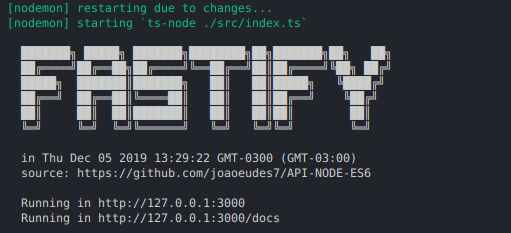

[](https://www.codefactor.io/repository/github/joaoeudes7/api-node-es6)

# API | Fastify | Typescript
#### Typescript
#### MongoDB



## Features:
* Debug available VsCode
* Clean code
* Hot update
* Security
* Rate Limit

### Note
* Requires MongoDb running (default: mongodb://localhost:27017)
* Configs in: src/app/config

## Install
Install dependencies
```
yarn install

// if npm: Replace the term 'yarn' with 'npm'
```

## Running Dev

```
yarn dev
```

## Running Build and Usage
Build the project for use
```
yarn build
```

and run ....

```
yarn start
```
